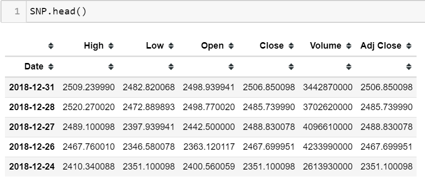
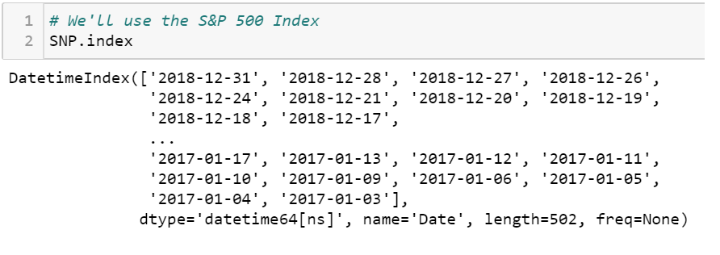
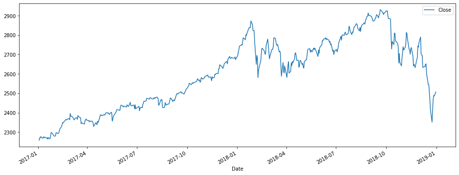
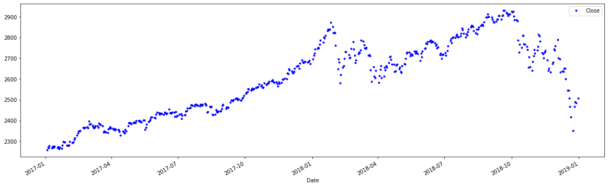
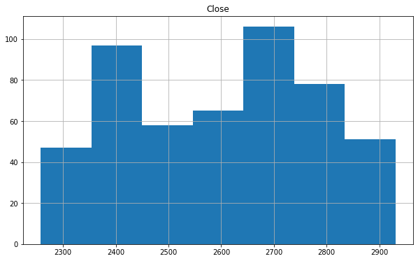
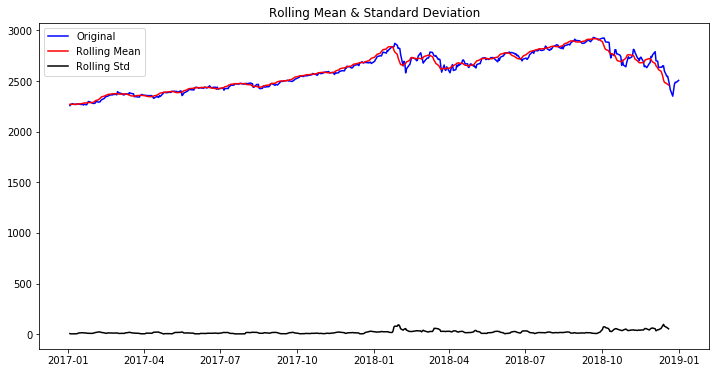
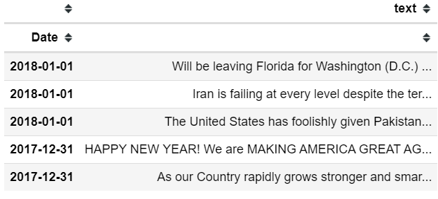
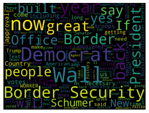
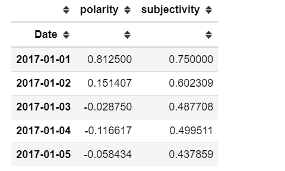

<center> <h1>Stock predictions (S&P 500 index) via Presidential Tweets 
</h1> </center>


There are numerous resources (get rich quick schemes) on just how to play to stock market. This project will attempt to make predictions on the S&P 500 index concentrating on the daily close value, as opposed to the corporate adj. close value. The data source was secured directly within this jupyter notebook via the pandas datareader library. With this I was able to pass in the parameters (dates) of the time-series data I required. For additional features to predict on I chose to use President Trumps tweets, to make this interesting indeed. Most stock predictors use news sources, financial reports, as well as sentiment analysis I'll be attempting to recreate here on a much smaller scale. 

#### Time series data
```python
import pandas_datareader.data as web

start = dt.datetime(2017, 1, 1)
end = dt.datetime(2019, 1, 1) # for current data use (now)

SNP = web.DataReader('^GSPC', 'yahoo', start, end).sort_index(ascending=False) # index
```
**Here used Yahoo Fiancial as the endpoint, other sources available directly within python via the pandas library are:**

* Tiingo
* IEX
* Alpha Vantage
* Enigma
* Quandl
* St.Louis FED (FRED)
* Kenneth French’s data library
* World Bank
* OECD
* Eurostat
* Thrift Savings Plan
* Nasdaq Trader symbol definitions
* Stooq
* MOEX 


**Stock Data dictionary:**
* Date - date of trade
* High - highest for the trading day
* Low - lowest for the trading day
* Open - opening price of stock begining of trading day
* Close - end of a trading session
* Volume - the number of shares that changed hands during a given day
* Adj Close - close based on corporate actions

Notice the date is already on the x axis



Here I verified that the index was indeed a datetime object 


Line plot on daily close prices of the entire dataset predictions will be calculated on


Dot plot of the same metric



S&P histogram displays normal distribution


#### Stationarity


* Results of Dickey-Fuller Test: 
* Test Statistic                  -0.297582
* p-value                          0.925846
* #Lags Used                       8.000000
* Number of Observations Used    493.000000
* Critical Value (1%)             -3.443684
* Critical Value (5%)             -2.867420
* Critical Value (10%)            -2.569902
* dtype: float64

#### Natural Language Toolkit
Presidential tweets are in two json files for the dates needed, many exceed Twitter's 140 chars rule. Which didn't pose a problem for the textblob library and provided additional data to use for sentiment analysis. 'TextBlob is a Python (2 and 3) library for processing textual data. It provides a simple API for diving into common natural language processing (NLP) tasks such as part-of-speech tagging, noun phrase extraction, sentiment analysis, classification, translation, and more.'


```python
# tweets are already in decending order
Tweets_17_df.head()
```


```python
import nltk
from textblob import TextBlob
# Performing a test on the TextBlob library
tweet_example = TextBlob('the democrats have been told and fully understand that there can be no daca without the desperately needed wall at the southern border and an end to the horrible chain migration ridiculous lottery system of immigration etc we must protect our country at all cost')

tweet_example.tags
[('the', 'DT'),
 ('democrats', 'NNS'),
 ('have', 'VBP'),
 ('been', 'VBN'),
 ('told', 'VBN'),
 ('and', 'CC'),
 ('fully', 'RB'),
 ('understand', 'VBP'),
 ('that', 'IN'),
 ('there', 'EX'),
 ('can', 'MD'),
 ('be', 'VB'),
 ('no', 'DT'),
 ('daca', 'NN'),
 ('without', 'IN'),
 ('the', 'DT'),
 ('desperately', 'RB'),
 ('needed', 'VBN'),
 ('wall', 'NN'),
 ('at', 'IN'),
 ('the', 'DT'),
 ('southern', 'JJ'),
 ('border', 'NN'),
 ('and', 'CC'),
 ('an', 'DT'),
 ('end', 'NN'),
 ('to', 'TO'),
 ('the', 'DT'),
 ('horrible', 'JJ'),
 ('chain', 'NN'),
 ('migration', 'NN'),
 ('ridiculous', 'JJ'),
 ('lottery', 'NN'),
 ('system', 'NN'),
 ('of', 'IN'),
 ('immigration', 'NN'),
 ('etc', 'FW'),
 ('we', 'PRP'),
 ('must', 'MD'),
 ('protect', 'VB'),
 ('our', 'PRP$'),
 ('country', 'NN'),
 ('at', 'IN'),
 ('all', 'DT'),
 ('cost', 'NN')]
 
 tweet_example.words
 WordList(['the', 'democrats', 'have', 'been', 'told', 'and', 'fully', 'understand', 'that', 'there', 'can', 'be', 'no', 'daca', 'without', 'the', 'desperately', 'needed', 'wall', 'at', 'the', 'southern', 'border', 'and', 'an', 'end', 'to', 'the', 'horrible', 'chain', 'migration', 'ridiculous', 'lottery', 'system', 'of', 'immigration', 'etc', 'we', 'must', 'protect', 'our', 'country', 'at', 'all', 'cost'])
```
The textblob library
* polarity - how positive or negative a word is -1 very neg, +1 very pos
* subjectivity - how opinionated a word is 0 fact, +1 very much an opinion

Here I tested the sentiment analysis of the textblob library available in python, with this test I concluded that there was no difference in passing in cleaned text over the default text of a json file. 
```python
# TextBlob test
# values are identical when lowercase and all punctuations removed.
TextBlob('the democrats have been told and fully understand that there can be no daca without the desperately needed wall at the southern border and an end to the horrible chain migration ridiculous lottery system of immigration etc we must protect our country at all cost').sentiment
Sentiment(polarity=-0.48333333333333334, subjectivity=0.75)
```

```python
# sentiment analysis on 2017 dataframe
polarity = lambda x: TextBlob(x).sentiment.polarity
subjectivity = lambda x: TextBlob(x).sentiment.subjectivity

Tweets['polarity'] = Tweets['text'].apply(polarity) 
Tweets['subjectivity'] = Tweets['text'].apply(subjectivity)

Tweet_analysis.head()
```




#### Analysis
Utilizing additional features (sentiment analysis) provided a glance of what is possible in making future forecasting predictions.
Average model error: 0.01 degrees
Accuracy: 99.98 % Mean absolute percentage error (MAPE)
RMSE 0.00893348391850772 (not a good measurement for this type of data)

The future of stock forecasting and prediction isn't a new concept, with that said the S&P 500 has had unforeseen crashes within the last 50 years:

* 1973 | Conflict in the Middle East **-48.2 percent loss**, 70 months recovery
* 1980 | Stagflation **-27.1 percentage loss**, 3 months recovery
* 1987 | Black Monday **-33.5 percentage loss**, 20 months recovery
* 1990 | Gulf War **-19.9 percentage loss**, 4 month recovery
* 2000 | The Tech Bubble Bursts **-49.1 percentage loss**, 56 months recovery
* 2007 | Real Estate Goes Bust **-56.9 percentage loss**, 49 months recovery<br/>

Jun/Jul 2020 aarp.org